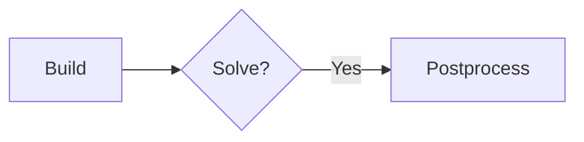

# Zensical authoring reference

Content syntax is Python Markdown + [PyMdown Extensions] — identical to Material
for MkDocs. Everything below works with Zensical's default extension set unless a
"needs" note says otherwise.

Remember: **four-space indentation** for nested content, and links point at `.md`
files relatively.

## Front matter

```yaml
---
title: Overrides the nav entry and <title> tag
description: Used for the meta description tag
icon: lucide/braces          # icon shown in the nav
status: new                  # needs [project.extra.status] mapping; new/deprecated predefined
tags: [Setup, Electricity]   # needs the tags feature
template: my_homepage.html   # custom template from the overrides dir
hide:
  - navigation               # left sidebar
  - toc                      # right sidebar
  - path                     # breadcrumbs
  - footer                   # prev/next links
  - tags
search:
  exclude: true              # keep the page out of the search index
---
```

Exclude a section or block from search with `## Section { data-search-exclude }`
or a trailing `{ data-search-exclude }` line under a block.

## Admonitions

```markdown
!!! note "Optional custom title"

    Body indented four spaces.

!!! note ""          # no title bar
??? note             # collapsible, initially closed
???+ note            # collapsible, initially open
!!! info inline end "Floats right"
```

Types: `note`, `abstract`, `info`, `tip`, `success`, `question`, `warning`,
`failure`, `danger`, `bug`, `example`, `quote`. Admonitions nest — indent the
inner one four more spaces.

## Content tabs

```markdown
=== "Tab one"

    Content indented four spaces.

=== "Tab two"

    ``` py
    print("fences work inside tabs")
    ```
```

`===!` starts a *new* tab set immediately after a previous one. Tabs with the
same labels sync across the page when `content.tabs.link` is enabled. Tabs nest
inside admonitions and grids.

## Code blocks

````markdown
``` py title="bubble_sort.py" linenums="1" hl_lines="2 3"
def bubble_sort(items): ...
```
````

- Inline highlighting: `` `#!python range()` ``.
- Per-block toggles via attribute lists: ``` ``` { .yaml .copy .annotate .select } ```
  (note the leading `.` on the language when using this form), and the negations
  `.no-copy` / `.no-select`.
- **Annotations**: put `# (1)!` in a comment, then a numbered list item right
  after the block supplies the content. The trailing `!` strips the comment
  characters from the rendered output. Needs the `content.code.annotate` feature
  (or `.annotate` on the block).
- **Embed a file** (needs `pymdownx.snippets`): `;--8<-- ".browserslistrc"` inside
  a fenced block, or `--8<-- "path"` in prose.
- Use four backticks to fence a block that itself contains a fence.

## Diagrams

Mermaid works out of the box (superfences `custom_fences` maps `mermaid` to a
client-side fence):

````markdown

````

Supported: flowcharts, sequence, state, class, entity-relationship diagrams.

## Math

Needs `pymdownx.arithmatex` with `generic = true` plus a MathJax/KaTeX script —
see `configuration.md`. Then:

```latex
Inline: $f(x)$ or \(f(x)\)

$$
\sum_{t \in T} c_t g_t
$$
```

## Tables

```markdown
| Method   | Description       |
| :------- | ----------------: |
| `GET`    | Fetch resource    |
```

`:---` left, `:---:` center, `---:` right. Sortable tables need tablesort wired
in via `extra_javascript`.

## Images

```markdown
{ width="300" align=left loading=lazy }

{ width="300" }
/// caption
Figure caption
///
```

The `/// caption` block needs `pymdownx.blocks.caption`, which is **not** in
Zensical's default set — and declaring any extension replaces the defaults
wholesale, so enabling it means re-declaring the rest too. See `configuration.md`.

Light/dark variants: append `#only-light` / `#only-dark` to the image URL.

## Grids and cards

```html
<div class="grid cards" markdown>

-   :material-clock-fast:{ .lg .middle } __Set up in 5 minutes__

    ---

    Install and get running in minutes.

    [:octicons-arrow-right-24: Getting started](get-started.md)

</div>
```

A plain `<div class="grid" markdown>` lays out arbitrary blocks; add `{ .card }`
under a block to card-ify it. Needs `attr_list` + `md_in_html`.

## Buttons

```markdown
[Read the guide](guide.md){ .md-button }
[Get started](start.md){ .md-button .md-button--primary }
[Send :fontawesome-solid-paper-plane:](#){ .md-button }
```

## Icons and emojis

`:smile:`, `:material-check:`, `:fontawesome-brands-python:`,
`:octicons-tag-16:`, `:lucide-sigma:`. Style them with attribute lists:
`:octicons-heart-fill-24:{ .heart }` plus CSS in `extra_css`.

## Tooltips and abbreviations

```markdown
[Hover me](https://example.com "I'm a tooltip!")
:material-information-outline:{ title="Important information" }

The HTML spec is maintained by the W3C.

*[HTML]: Hyper Text Markup Language
*[W3C]: World Wide Web Consortium
```

Project-wide glossary: put the `*[ABBR]:` definitions in `includes/glossary.md`
and set `pymdownx.snippets.auto_append = ["includes/glossary.md"]`.

## Lists

```markdown
- [x] Completed task
- [ ] Open task

`Term`

:   Definition, indented four spaces.
```

Nested list content needs four spaces. Python Markdown does *not* start a new
list when the bullet character changes.

## Footnotes

```markdown
Some claim[^1] and another.[^2]

[^1]: Single-line footnote.
[^2]:
    Multi-line footnote, indented four spaces.
```

## Inline formatting

`==highlight==`, `^^underline^^`, `~~strikethrough~~`, `H~2~O`, `A^T^A`,
`++ctrl+alt+del++`.

## Instant previews

Any header link can show a hover preview with `[text](page.md#anchor){ data-preview }`,
or enable them wholesale via the preview extension (see `configuration.md`).
Requires `site_url`.

[PyMdown Extensions]: https://facelessuser.github.io/pymdown-extensions/
