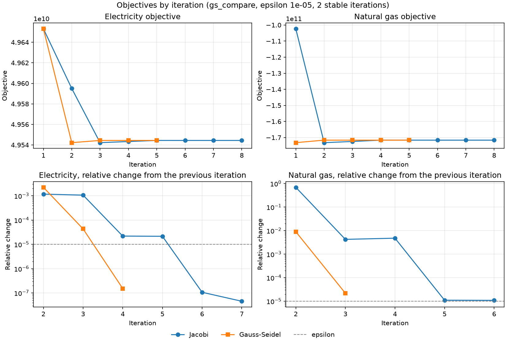
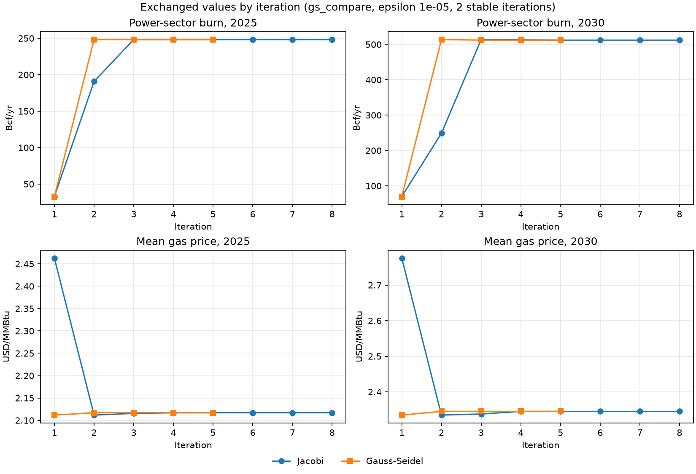

# Gauss-Seidel and Jacobi for the electricity and natural gas coupling


## 1. Summary

The `gauss-seidel` branch adds a second iteration scheme for the integrated electricity and
natural gas run. It sits beside the Jacobi iterator inside the same `IterativeSequencer`
framework, and uses the same packages, region crosswalk, routing and stopping rule.

What differs is how the models are run:
- Each model is built once and updated in place between solves using mutable parameters, rather than rebuilt every
  iteration.
- Each model keeps its solver, so a re-solve sends only what changed.
- The models solve in turn: gas sees the electricity burn from the same iteration, not the
  previous one.

On the same economics and the same stopping rule:
- On every region with two years, over two runs each, Gauss-Seidel stopped after 4 iterations
  in 67 to 75 s, and Jacobi after 6 iterations in 306 to 312 s: 4.1 to 4.7 times faster. At a
  tighter tolerance, 5 iterations in 80 s against 8 in 432 s, 5.4 times faster.
- The final objectives agree to a relative 5e-8 for electricity and exactly for gas, and the
  final burn and mean gas prices match to the digits shown, in every run.
- Rebuilding dominates Jacobi's iterations. It is about 80% of each iteration at 3 regions,
  and about 60% at 25 regions with 4 years.

Changes that would alter the answer itself are kept out of this comparison; §6 lists them.

## 2. How Gauss-Seidel fits the Jacobi infrastructure

| Piece | Shared with Jacobi | Gauss-Seidel's own |
|---|---|---|
| Framework | `IterativeSequencer`, `RunStatus`, `IterationResult`, `IntegratedModelSequencer` | `GaussSeidelIterator`, `gs_config.toml`; run mode `integrated gs` |
| Data exchange | `UpdatePackage` types and each model's writer, so the same quantities cross the same crosswalk | Each model also has a reader for its *built* instance, behind `update_model` |
| Regions | The population-weighted crosswalk (`region_crosswalk.py`) | `build_preflight` checks before the first solve that the regions cover each other |
| Routing | `route_updates`, and the resend-last-accepted rule after a failed solve | Solves in sequence: electricity, then gas |
| Stopping | `ConvergenceTracker`, epsilon, `convergence_iterations`, `ALLOW_TERMINATION` | none |
| Output | `MAIN.log` plus per-model logs, the iteration monitor | Writes result files for both models at the end |

The update contract. `update_model(packages)` leaves the built model the same optimization
problem that a rebuild with those packages would give. For the electricity model, the gas price
enters through `ng_fuel_adj`, a mutable parameter added to `supply_price` in the dispatch cost.
Its value is computed by `ng_price_adjustment`, which for now is exactly Jacobi's multiplicative
link. Tests check the contract entry by entry, to a relative 1e-12:
- the effective electricity cost of every row
- every gas demand cell

## 3. Method

- Configuration. `run_configs/gs_compare.toml`: every electricity region and every gas region,
  years 2025 and 2030, with interregional exchange and "end_use" load.
  - Every electricity region's burn falls in gas regions the gas model holds, and every gas region
    is covered completely, so both schemes see the same gas demand.
  - The region crosswalk has only two closed groups: electricity region 7 with New England, and
    everything else. New England alone has no pipeline supply and solves only with unserved
    demand, so the full set is the smallest useful fully covered case.
- Economics. As on main: the multiplicative link, gas turbine only, a 4 USD/MMBtu reference.
- Stopping. As on main: relative objective change below epsilon (0.001) for 2 consecutive
  iterations, at most 15 iterations.
- Solvers. HiGHS for electricity. Gas takes the first available of Gurobi's interfaces, then
  HiGHS. Both schemes use the same solver on the same machine.
- Measurement. `analysis_tools/compare_iterators.py` runs both schemes on one config, back to
  back. It records wall time, iterations, and per model the build, update, solve and collect
  seconds (`IterationResult.timings`).
- Parallel against sequential. Jacobi solves its models in parallel worker processes;
  Gauss-Seidel solves them in sequence in one process. Wall time is the fair comparison.
- Machine. A laptop on mains power: Intel Core i5-1240P (12 cores, 16 threads), 16 GB RAM,
  Windows 11, Balanced power plan. Jacobi used its default 6 worker processes. Runs on battery
  power earlier in the day were up to twice as slow for both schemes and are not used here.

## 4. Results

### 4.1 Updating in place matches a rebuild

| Check | Result |
|---|---|
| Electricity, after a price package applied twice and then a narrower one | every row's effective price matches a rebuild to a relative 1e-12 |
| Gas, after a burn package covering every power-sector cell | every demand cell matches a rebuild to a relative 1e-12 |
| Updating a held electricity model | about 0.01 s at 25 regions (test config, all regions), against 35 s to build that model |

### 4.2 Keeping the solver

After a price update, the re-solve of a held electricity model:

| Regions | Kept solver | New solver | Objectives |
|---|---|---|---|
| 3 (test config) | 0.3 to 0.4 s | 1.3 s | identical |
| 25 | 4.5 s | 12.6 to 13.1 s | agree to 1e-16 |

### 4.3 Where Jacobi's time goes

Per iteration, from the electricity worker's log, one run each:

| Config | Per iteration | Preprocessing | Build | Solve |
|---|---|---|---|---|
| `jacobi_small`, 3 regions, 2 years | ~35 s | 20 to 24 s | 6 to 7 s | ~7 s |
| All 25 regions, 4 years, no MAGIC | ~77 s | ~29 s | ~18 s | ~29 s |

Every iteration repeats the preprocessing and the build. Gauss-Seidel does them once.

### 4.4 Head to head

`gs_compare.toml`, default settings (epsilon 0.001, 2 stable iterations), run twice back to
back with `pixi run gs-compare`:

| | Jacobi run 1 | Jacobi run 2 | Gauss-Seidel run 1 | Gauss-Seidel run 2 |
|---|---|---|---|---|
| Status | stopped by the objective rule | same | stopped by the objective rule | same |
| Iterations | 6 | 6 | 4 | 4 |
| Wall time, s | 312 | 306 | 67 | 75 |
| Build time summed over models and iterations, s | 222.0 | 212.4 | 34.5 | 35.2 |
| Solve time summed, s | 82.7 | 86.8 | 26.0 | 32.0 |
| Collect time summed (objective and outbound packages), s | 3.7 | 3.7 | 2.5 | 2.9 |
| Update time summed, s | none | none | under 0.1 | under 0.1 |

Final values, the same in all four runs:

| | Jacobi | Gauss-Seidel |
|---|---|---|
| Electricity objective | 4.954437e+10 | 4.954437e+10 |
| Gas objective | -1.716258e+11 | -1.716258e+11 |
| Power-sector burn, Bcf, 2025 / 2030 | 248.3 / 512 | 248.3 / 512 |
| Mean gas price, USD/MMBtu, 2025 / 2030 | 2.117 / 2.345 | 2.117 / 2.345 |

The relative difference in the final objectives is 4.6e-8 for electricity and 0 for gas.

Where the time goes.
- Jacobi rebuilds both models every iteration: 212 to 222 s of its 306 to 312.
- Gauss-Seidel builds once, in about 35 s.
- It needs two fewer iterations, because gas sees the same iteration's burn.
- Its solves are cheaper, because the solvers are kept.
- Its wall time includes writing result files for both models at the end, which Jacobi does not
  do.

Gauss-Seidel's sums are close to its wall time because it runs in one process. Jacobi's exceed
what its wall time would allow, because its two models run in parallel.

A note on burn. 248 to 512 Bcf a year is far below the power sector's real gas use. Under
main's economics only the gas turbine is linked and counted, and combined cycle burns most power
sector gas. This is the combined-cycle item in §6.

### 4.5 Tighter tolerance

The same config with epsilon 1e-5 (2 stable iterations, limit 25), one run:

| | Jacobi | Gauss-Seidel |
|---|---|---|
| Iterations | 8 | 5 |
| Wall time, s | 432 | 80 |
| Build time summed, s | 300.7 | 36.1 |
| Solve time summed, s | 114.9 | 34.9 |
| Final objectives, burn and prices | identical | identical (relative difference 0) |

Relative objective change by iteration:

| Iteration | Jacobi electricity | Jacobi gas | Gauss-Seidel electricity | Gauss-Seidel gas |
|---|---|---|---|---|
| 2 | 1.2e-3 | 6.9e-1 | 2.2e-3 | 9.0e-3 |
| 3 | 1.1e-3 | 4.3e-3 | 4.4e-5 | 2.2e-5 |
| 4 | 2.2e-5 | 4.8e-3 | 1.5e-7 | 0 |
| 5 | 2.2e-5 | 1.1e-5 | 0 | 0 |
| 6 | 1.1e-7 | 1.1e-5 | | |
| 7 | 4.6e-8 | 0 | | |
| 8 | 0 | 0 | | |

Gauss-Seidel's gas objective is close to its final value after the first iteration (a 0.9%
change in iteration 2), because its gas model sees electricity's burn from the start. Jacobi's
gas model starts from its own baseline demand and moves 69% in iteration 2. Both reach the same
final values.

### 4.6 How the two runs approach the answer

The figures are from the epsilon 1e-5 run (§4.5). The default-tolerance runs (§4.4) follow the
same paths and stop earlier. `pixi run gs-compare` draws both figures for any run.





What they show:
- Iteration 1 is the same electricity solve in both schemes, with no gas price yet, so both send
  the same burn: 32.9 Bcf in 2025.
- Gauss-Seidel's gas model then solves on that burn in the same iteration. Its first mean gas
  price for 2025, 2.112 USD/MMBtu, is already within 0.3% of the final 2.117. Jacobi's first gas
  solve sees only the gas model's own baseline demand, so its first price is 2.463, and from then
  on it follows electricity's burn one iteration late.
- Once electricity sees gas prices around 2.1, about half the 4 USD/MMBtu reference, 2025 burn
  rises to its final 248.3 Bcf. Gauss-Seidel gets there in iteration 2. Jacobi reaches 190.8 Bcf
  in iteration 2 and 248.3 in iteration 3.
- Jacobi's relative changes come in pairs: iterations 4 and 5 for electricity, 3 and 4 for gas.
  Each model is reacting to the other's previous iteration, so a change takes two iterations to
  pass through. Gauss-Seidel's changes fall by about two orders of magnitude each iteration.
- On the relative-change panels a line stops where the objective stopped changing exactly,
  because a change of zero cannot be drawn on a log scale.

`pixi run gs-compare` draws the same two figures for a default-tolerance run, or any other.

## 5. Why the economics are held fixed for this comparison

The iteration scheme does not move a unique equilibrium. The equations do. The link between gas
price and electricity cost is part of the equations.

For a gas turbine row with supply price s per MWh, each +1 USD/MMBtu of gas adds:

| Link | Added cost per MWh |
|---|---|
| Multiplicative (main) | 0.125 x s, so 4.12 at the median s of 33 |
| Additive (heat rate x price change) | 9.51 at any s |

The two agree only at s = 76; the rows run from 13.8 to 200. Different links give different
equilibria and different objective values. So the speed comparison uses main's link, and a
change of link is argued separately (§6).

## 6. Changes that alter the answer that we might want to implement

| Change | The case for it | Evidence still to produce |
|---|---|---|
| Additive price link | Fuel cost moves by heat rate x price change, whatever a row's cost mix. The multiplicative link assumes every gas row is 50% fuel | Objectives, burn and prices under each link; effect size |
| Combined cycle linked | It burns gas but is not coupled with price yet | Changes burn accounting as well as price response |
| Declared reference price | The 4 USD/MMBtu is a placeholder | Source, and sensitivity |
| Coverage top-up on filtered runs | Jacobi replaces a partly covered gas region's power-sector demand with the partial burn, and holds uncovered regions flat at their 2025 value | Check the population-share assumption against the full run's burn by region; demand under each policy |
| Stopping on exchanged quantities | On the 4-year 25-region run the electricity objective moved by only 1e-5 to 1e-7 in the last iterations, which may stop a run before burn and prices settle | Runs where the objective rule and a residual rule disagree |

## 7. Not claimed here

- Nothing about convergence of either scheme in general. The runs above stopped by the
  objective-change rule on these configurations.
- Nothing about region-filtered runs. They depend on the coverage policy (§6).
- Each timing is one run on one machine, unless repeats are shown.

## 8. Reproduce

```powershell
pixi shell
python -m analysis_tools.compare_iterators run_configs/gs_compare.toml
python -m analysis_tools.compare_iterators run_configs/gs_compare.toml --epsilon 1e-5 --limit 25
pytest tests/integrator -q -n0
```
