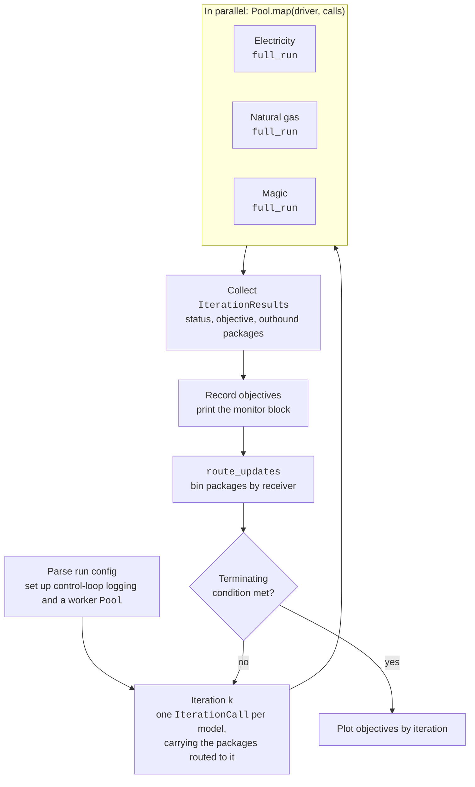
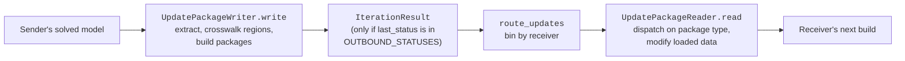

# Integrated Runs

An integrated run solves several models repeatedly, passing results between them after each
round, so that each model's inputs reflect the other models' latest solutions: gas prices in the
electricity model, electricity-sector gas burn in the natural gas model, and so on. The only
integrated driver today is `src/integrator/combine.py`:

```sh
pixi shell
python -m src.integrator.combine      # reads run_configs/full_combo.toml
```

The run config holds a `[common]` section plus one section per participating model
(`[elec_config]`, `[natural_gas]`, and optionally `[magic_config]`).

## Jacobi Iteration

`combine.py` couples the models with **Jacobi-style** iteration. Every model in the circuit
(`CIRCUIT`: electricity, natural gas, magic) solves in the same iteration, in parallel. Each one
sees only the results the others sent at the end of the *previous* iteration. (In a Gauss-Seidel
scheme, by contrast, the models would solve one after another, and each would see results from
the models ahead of it in the same iteration.) Jacobi iteration lets the models run
side by side, at the cost of results that take one iteration to reach the other models.



Within one iteration, each worker runs its model's `IntegratedModelSequencer.full_run`:

1. `build_model(common_config, model_config, update_packages=...)`: load the model's inputs, then
   apply the packages routed to it (see [Inter-model Communication](#inter-model-communication)),
   then build.
2. `solve_model()`: returns the model's `IterationStatus`.
3. `get_objective_value()` and `get_outbound_updates()`: returned to the control process as an
   `IterationResult`.

Things to know about the current loop:

- **Iteration 1 starts with no packages**, so every model begins from its input files alone.
- **Models are rebuilt every iteration.** `update_model` is not implemented yet, so a new model
  instance is built from the inputs plus the latest packages each time.
- **Each model logs to its own file.** Each worker writes a per-model scenario log, and the
  control process writes the `MAIN` log and prints the iteration monitor to the console.
- **The run ends** when every model's values are stable from one iteration to the next, or when
  the iteration limit (`iter_limit`) is reached. It then plots each model's objective by
  iteration; the plot window blocks until it is closed.

!!! warning "Region filters in integrated runs"

    A model that is filtered to a subset of regions only sends packages covering the other
    model's regions that overlap its own. It also ignores inbound entries for regions it doesn't
    hold. The receiving model keeps loaded (base-year) values wherever coverage is missing, so
    filtering either model can give odd results in an integrated run. `combine.py` logs a
    warning when either model is filtered.

## Inter-model Communication

Models never read each other's variables directly. Instead, all data passing between models is
carried in **update packages**, defined in `src/common/update_package/`. An update package is a
small, frozen, picklable dataclass. It names its `receivers` (one or more `ModelType`s, or
`ModelType.ALL`), gives a short `label` and a `size` for the monitor, and carries a payload. The
payload is usually a `(region, year)`-indexed frame already mapped onto the receiver's regions.

Each package travels the same route:



- **Writing.** Each model has an `UpdatePackageWriter` (`update_writer.py`) that turns its solved
  model into outbound packages. The sequencer only calls it after a usable solve: one whose
  status is in `OUTBOUND_STATUSES`, which defaults to `BEST` or `USABLE`. After a failed solve,
  the model sends nothing, and the receivers keep their loaded values.
- **Routing.** `route_updates` in `combine.py` delivers every package to each receiver in the
  circuit. A receiver outside the circuit gets nothing, and a warning is logged.
- **Reading.** Each model has an `UpdatePackageReader` (`update_reader.py`) that applies inbound
  packages to the model's loaded data *before* the model is built. It picks a handler by package
  type; a type with no registered handler raises an error. Handlers update individual parameters
  in place: they replace or scale the matching entries, keep loaded values for any entries a
  package does not cover, and log warnings about gaps and large changes.

The packages exchanged today:

| Label            | Package                     | Sender → Receiver | Effect on the receiver                                                             |
|:-----------------|:----------------------------|:------------------|:-----------------------------------------------------------------------------------|
| NG Demand        | `NGElectricalDemandPackage` | Electricity → NG  | Replaces `electric_power` sector gas demand; that sector's growth projection is switched off |
| NG Prices        | `NGPricePackage`            | NG → Electricity  | Scales the supply price of gas-linked techs with the regional gas price             |
| Elec Price Scaler | `ElectricityPriceScaler`   | Magic → Electricity | Mock: scales supply prices of named techs                                        |
| Trans Cost       | `TransCostUpdate`           | Magic → Electricity | Mock: replaces transmission costs                                                |
| NG Demand Scaler | `NGDemandPackage`           | Magic → NG        | Mock: scales all gas demand                                                        |

### Watching the Exchange

After each iteration, `combine.py` prints a text monitor laid out like a sequence diagram
(`src/integrator/iteration_monitor.py`). Each model has a vertical lifeline, and the first
column is the iteration number. The monitor shows each model's objective, then one horizontal
arrow per package delivered. Each arrow leaves the sender's lifeline at a `+`, arrives at the
receiver's with an arrowhead, and is labelled with the package label and its entry count.

<figure markdown>

```text
            +-------------+           +-------------+              +-------+
  it        | Electricity |           | Natural Gas |              | Magic |
            +-------------+           +-------------+              +-------+
                   |                         |                         |
   1  (start 215,673,119,444.47)(start -467,269,438,762.62)          (N/C)
                   |                         |                         |
                   +---- NG Demand [72] ---->|                         |
                   |                         |                         |
                   |<--- NG Prices [250] ----+                         |
                   |                         |                         |
                   |<------------- Elec Price Scaler [2] --------------+
                   |                         |                         |
                   |<--------------- Trans Cost [506] -----------------+
                   |                         |                         |
                   |                         |< NG Demand Scaler [1] --+
```

<figcaption>Iteration 1 of an integrated run. <code>(start …)</code> is a model's first
objective value; later iterations show the change, e.g. <code>(+95,235,030,069.40)</code>.
<code>(N/C)</code> marks a model with no objective. <code>[n]</code> is the number of entries a
package carries.</figcaption>
</figure>

The console version is coloured by `src/integrator/monitor_style.toml`, and an uncoloured copy is
written to the `MAIN` log.

### Adding a Package Type

1. Define the dataclass in `src/common/update_package/update_package.py`, with validation in
   `__post_init__`.
2. Register a handler for it on the receiving model's reader.
3. Produce it in the sending model's writer.

Routing needs no changes, because it goes by each package's `receivers`.
