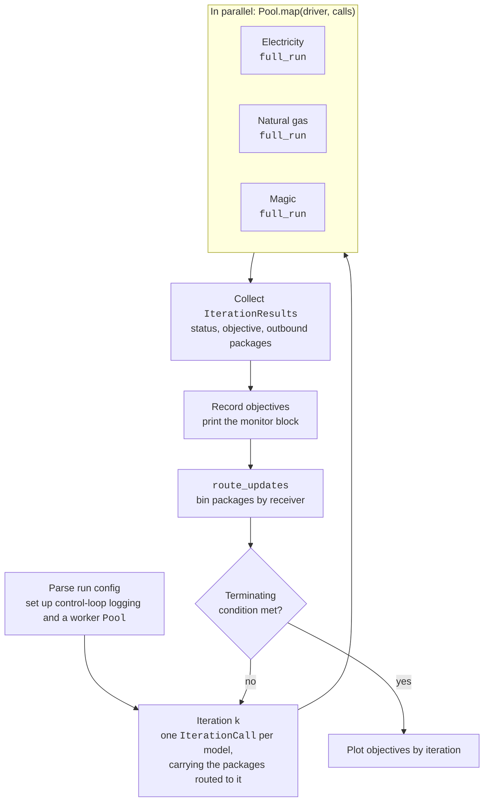
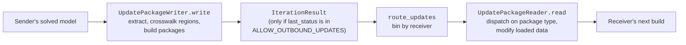

# Integrated Runs

An integrated run solves several models repeatedly, passing results between them after each
round, so that each model's inputs reflect the other models' latest solutions: gas prices in the
electricity model, electricity-sector gas burn in the natural gas model, and so on. The main
integrated driver is `JacobiIterator` in `src/integrator/jacobi/jacobi_iterator.py`, a
subclass of the `IterativeSequencer` base class (`src/common/iterative_sequencer.py`); an
experimental Gauss-Seidel driver is described [below](#gauss-seidel-iteration-experimental). The first runs through `main.py` with a config whose `[common]` mode is `"integrated jacobi"`:

```sh
pixi shell
python main.py run_configs/jacobi_large.toml
pixi run jacobi      # runs run_configs/jacobi_small.toml, a reduced run
```

The run config holds a `[common]` section plus one section per participating model
(`[elec_config]`, `[natural_gas]`, and optionally `[magic_config]`). The `[common]`
`models_to_run` list selects the models; `all` selects every model except the dev/test MAGIC
model, which runs only when named explicitly.

### Iterator Settings

The iterator's own settings live in `src/integrator/jacobi/jacobi_config.toml`, beside the
iterator, and are validated by `JacobiConfig` (`jacobi_config.py`) when a `JacobiIterator` is
created. Every key is required, and an unknown key is an error:

| Key                      | Meaning                                                                    |
|:-------------------------|:---------------------------------------------------------------------------|
| `iteration_limit`        | The most iterations to run                                                 |
| `epsilon`                | Convergence tolerance, a ratio in (0, 1]: the largest relative objective change that counts as stable |
| `convergence_iterations` | How many consecutive stable iterations end the run                         |
| `worker_processes`       | Size of the worker pool the models solve in                                |
| `monitor_delta_mode`     | How the monitor shows objective changes: `absolute`/`percent`              |

## Jacobi Iteration

`jacobi_iterator.py` couples the models with **Jacobi-style** iteration. Every selected model
solves in the same iteration, in parallel. The *circuit* is the selected models in a fixed order,
which sets the order packages are routed and applied in, so results are deterministic. By default
it is alphabetical by `ModelType` key (`DEFAULT_CIRCUIT`: electricity, magic, natural gas);
`JacobiIterator.run(..., circuit=...)` overrides it. Each model
sees only the results the others sent at the end of the *previous* iteration. (In a Gauss-Seidel
scheme, by contrast, the models would solve one after another, and each would see results from
the models ahead of it in the same iteration.) Jacobi iteration lets the models run
side by side, at the cost of results that take one iteration to reach the other models.


```mermaid
flowchart TD
    S["Parse run config<br/>set up control-loop logging and a worker <code>Pool</code>"] --> I
    I["Iteration k<br/>one <code>IterationCall</code> per model,<br/>carrying the packages routed to it"] --> P
    subgraph P ["In parallel: Pool.map(driver, calls)"]
        direction LR
        E["Electricity<br/><code>full_run</code>"]
        N["Natural gas<br/><code>full_run</code>"]
        M["Magic<br/><code>full_run</code>"]
    end
    P --> R["Collect <code>IterationResult</code>s<br/>status, objective, outbound packages"]
    R --> V["Record objectives<br/>print the monitor block"]
    V --> U["<code>route_updates</code><br/>bin packages by receiver"]
    U --> C{"Terminating<br/>condition met?"}
    C -- no --> I
    C -- yes --> Z["Plot objectives by iteration"]
```

Within one iteration, each worker runs its model's `IntegratedModelSequencer.full_run`:

1. `build_model(common_config, model_config, update_packages=...)`: load the model's inputs, then
   apply the packages routed to it (see [Inter-model Communication](#inter-model-communication)),
   then build.
2. `solve_model()`: returns the model's `IterationStatus`.
3. `get_objective_value()` and `get_outbound_updates()`: returned to the control process as an
   `IterationResult`.

Steps 2 and 3 are `solve_iteration()`, which a driver that keeps its models calls after
`update_model` instead of rebuilding.

Things to know about the current loop:

- **Iteration 1 starts with no packages**, so every model begins from its input files alone.
- **Models are rebuilt every iteration.** A new model instance is built from the inputs plus the
  latest packages each time. `update_model` can instead apply packages to a model that is already
  built, writing the fuel cost change implied by the gas price to `ng_fuel_adj` and the gas burn
  to the gas model's owned demand cells, but the Jacobi loop does not use it.
- **Each model logs to its own file.** Like a standalone run, the control process claims a fresh
  `<output_path>/<scenario_name>` folder, suffixed `_1`, `_2`, ... if it is taken, so a rerun never
  mixes with an earlier run's logs. Each worker writes a per-model log there
  (`electricity.log`, ...), and the control process writes `MAIN.log` and prints the iteration
  monitor to the console.
- **No result files are written yet.** `full_run` doesn't call `full_postprocess`, so the scenario
  folder ends up holding only `MAIN.log` and the per-model logs (`electricity.log`,
  `natural_gas.log`, plus `magic.log` when MAGIC runs). The objective plot is shown but not saved.
- **The run ends** when every model with an objective has changed by less than `epsilon`,
  relative to its previous objective, for `convergence_iterations` consecutive iterations, or when
  `iteration_limit` is reached (`ConvergenceTracker` in `jacobi/convergence.py`). The relative
  change makes the test independent of each model's objective scale. Models without an objective
  (MAGIC) are left out. A model whose status is outside `ALLOW_TERMINATION` (`BEST`, `USABLE`)
  holds the run open: a failed solve, or a `PENALTY` solve, whose results are accurate but lean on
  a soft limit such as unmet demand. `main.py` then plots each model's objective by iteration; the
  plot window blocks until it is closed.

!!! warning "Region filters in integrated runs"

    A model that is filtered to a subset of regions only sends packages covering the other
    model's regions that overlap its own. It also ignores inbound entries for regions it doesn't
    hold. The receiving model keeps loaded (base-year) values wherever coverage is missing, so
    filtering either model can give odd results in an integrated run. `jacobi_iterator.py` logs a
    warning when either model is filtered.

## Gauss-Seidel Iteration (experimental)

`GaussSeidelIterator` in `src/integrator/gauss_seidel/gs_iterator.py` is a second
`IterativeSequencer` for the electricity and natural gas models only. It runs through `main.py`
with `[common]` mode `"integrated gs"`:

```sh
pixi shell
python main.py run_configs/gs_compare.toml
pixi run gs            # the same
pixi run gs-compare    # Jacobi and Gauss-Seidel on that config, side by side
```

It differs from the Jacobi iterator in how the models are run, not in what they exchange:

- Both models are built once and held. Each iteration applies the inbound packages to the
  built models with `update_model` and re-solves them with `solve_iteration`, and each model keeps
  its solver between solves.
- The models solve in turn, electricity then gas, so gas sees the burn electricity produced in
  the same iteration.
- Coverage is checked before the first solve, by `build_preflight` in
  `src/integrator/ng_preflight.py`: the electricity and gas regions must cover each other. A
  run whose regions do not cover each other fully (most region filters) is refused unless
  `allow_partial_coverage` is set. In that case a partly covered gas region gets the burn plus a
  fixed top-up from its own projection for the uncovered share, and an uncovered one stays with
  the gas model.
- Result files are written at the end for each model whose last solve did not fail.

Packages, the crosswalk, routing (`route_updates`), the stopping rule (`ConvergenceTracker`) and
the monitor are the Jacobi iterator's. The rest of the per-iteration bookkeeping (the resend rule,
logging, the monitor display and the final status) is in `../../src/integrator/bookeeping_utilities.py`, which
both iterators call. The number in brackets on each monitor arrow is how many
entries the package carries, for example `[18]` for 9 gas regions by 2 years. Under each
iteration's block, the Gauss-Seidel iterator adds a line with the values behind them: the total
burn and the mean gas price by year. The settings are in
`src/integrator/gauss_seidel/gs_config.toml`: the same stopping keys as Jacobi's,
`monitor_delta_mode`, and `allow_partial_coverage`.

`python -m analysis_tools.compare_iterators <config>` runs both iterators on one config at the
same settings, and writes a side-by-side table to the output folder.

## Inter-model Communication

Models never read each other's variables directly. Instead, all data passing between models is
carried in **update packages**, defined in `src/common/update_package/`. An update package is a
small, frozen, picklable dataclass. It names its `receivers` (one or more `ModelType`s, or
`ModelType.ALL`), gives a short `label` and a `size` for the monitor, and carries a payload. The
payload is usually a `(region, year)`-indexed frame already mapped onto the receiver's regions.

Each package travels the same route:


```mermaid
flowchart LR
    A["Sender's solved model"] --> B["<code>UpdatePackageWriter.write</code><br/>extract, crosswalk regions,<br/>build packages"]
    B --> C["<code>IterationResult</code><br/>(only if last_status is in<br/>ALLOW_OUTBOUND_UPDATES)"]
    C --> D["<code>route_updates</code><br/>bin by receiver"]
    D --> E["<code>UpdatePackageReader.read</code><br/>dispatch on package type,<br/>modify loaded data"]
    E --> F["Receiver's next build"]
```

- **Writing.** Each model has an `UpdatePackageWriter` (`update_writer.py`) that turns its solved
  model into outbound packages. The sequencer only calls it after a usable solve: one whose
  status is in `ALLOW_OUTBOUND_UPDATES` (`BEST`, `USABLE`, or `PENALTY`). After a failed
  solve, the model sends nothing new; the control loop resends that model's last accepted packages
  instead (`accept_packages` in `bookeeping_utilities.py`, which both iterators use), so its receivers keep seeing its last good solution. Only a model that has never
  solved usably leaves its receivers on their loaded values.
- **Routing.** `route_updates` in `jacobi_iterator.py` delivers every package to each receiver in the
  circuit. A receiver outside the circuit gets nothing, and a warning is logged.
- **Reading.** Each model has an `UpdatePackageReader` (`update_reader.py`) that applies inbound
  packages to the model's loaded data *before* the model is built. It picks a handler by package
  type; a type with no registered handler raises an error. Handlers update individual parameters
  in place: they replace or scale the matching entries, keep loaded values for any entries a
  package does not cover, and log warnings about gaps and large changes.

The packages exchanged today:

| Label            | Package                     | Sender → Receiver | Effect on the receiver                                                             |
|:-----------------|:----------------------------|:------------------|:-----------------------------------------------------------------------------------|
| NG Demand        | `NGElectricalDemandPackage` | Electricity → NG  | Replaces `electric_power` sector gas demand; that sector's growth projection is switched off |
| NG Prices        | `NGPricePackage`            | NG → Electricity  | Scales the supply price of gas-linked techs with the regional gas price             |
| Elec Price Scaler | `ElectricityPriceScaler`   | Magic → Electricity | Mock: scales supply prices of named techs                                        |
| NG Demand Scaler | `NGDemandScaler`            | Magic → NG        | Mock: scales all gas demand                                                        |

### Watching the Exchange

After each iteration, `jacobi_iterator.py` prints a text monitor laid out like a sequence diagram
(`src/integrator/iteration_monitor.py`). Each model has a vertical lifeline, and the first
column is the iteration number. The monitor shows each model's objective, then one horizontal
arrow per package delivered. Each arrow leaves the sender's lifeline at a `+`, arrives at the
receiver's with an arrowhead, and is labelled with the package label and its entry count.

<figure markdown>

```text
            +-------------+           +-------------+              +-------+
  it        | Electricity |           | Natural Gas |              | Magic |
            +-------------+           +-------------+              +-------+
                   |                         |                         |
   1  (start 215,673,119,444.47)(start -467,269,438,762.62)          (N/C)
                   |                         |                         |
                   +---- NG Demand [72] ---->|                         |
                   |                         |                         |
                   |<--- NG Prices [250] ----+                         |
                   |                         |                         |
                   |<------------- Elec Price Scaler [2] --------------+
                   |                         |                         |
                   |                         |< NG Demand Scaler [1] --+
```

<figcaption>Iteration 1 of an integrated run. <code>(start …)</code> is a model's first
objective value; later iterations show the change, e.g. <code>(+95,235,030,069.40)</code>.
<code>(N/C)</code> marks a model with no objective. <code>[n]</code> is the number of entries a
package carries.</figcaption>
</figure>

The console version is coloured by `src/integrator/monitor_style.toml`, and an uncoloured copy is
written to the `MAIN` log.

### Adding a Package Type

1. Define the dataclass in `src/common/update_package/update_package.py`, with validation in
   `__post_init__`.
2. Register a handler for it on the receiving model's reader.
3. Produce it in the sending model's writer.

Routing needs no changes, because it goes by each package's `receivers`.
