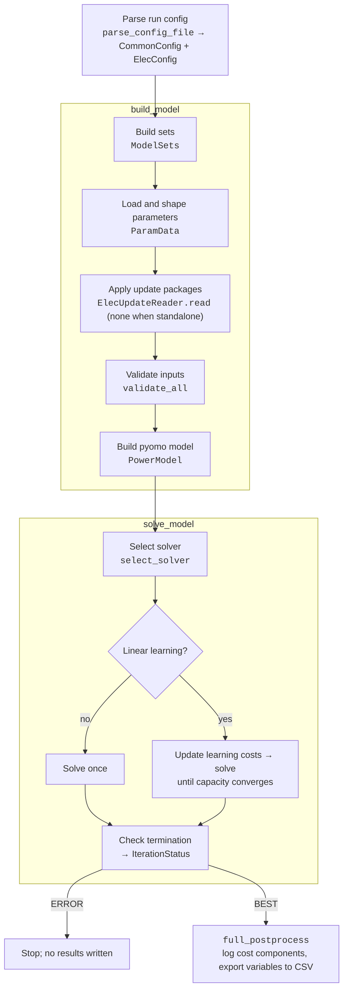

# Standalone Runs

A standalone run builds, solves, and reports a single model in the current process, with no
other models in the loop. It is the everyday mode for developing and testing a model, and the
mode the test suite exercises.

## The Sequencer

Every model is driven by a *sequencer*: a subclass of `IntegratedModelSequencer`
(`src/common/integrated_model_sequencer.py`). It owns the built model and the configs it was
built from, and exposes the same small set of steps for every model:

| Step                      | Purpose                                                            |
|:--------------------------|:-------------------------------------------------------------------|
| `build_model`             | Load inputs, apply any inbound update packages, build the model    |
| `solve_model`             | Solve and report an `IterationStatus` (`BEST`, `USABLE`, `ERROR`)  |
| `full_postprocess`        | Log diagnostics and write results                                  |
| `get_objective_value`     | Report the solved objective, or `None` for a model without one     |
| `get_outbound_updates`    | Package results for other models (used only in integrated runs)    |

A standalone run uses these same steps and simply passes no update packages, so the model is
built from its input files alone. Because both run modes share the same steps, a model that runs
correctly on its own can also run in an integrated run.

## Flow of a Standalone Run

The electricity model is the reference case. `main.py` parses a run config and calls
`run_elec_model`, a thin wrapper over `ElectricitySequencer`:

The natural gas model has the same shape. Its standalone entry point is the `__main__` block of
`src/models/natural_gas/sequencer.py`, which runs `load_all` → `NGUpdateReader` → `NGModel` for
the build, then a QP solve, then `report` for postprocessing.

!!! note "What happens with update packages in a standalone run"

    `build_model` still hands the (empty) package list to the model's update reader. The reader
    does nothing in that case, so the model is built from its input files alone. The sequencer
    never calls `get_outbound_updates` in a standalone run.
